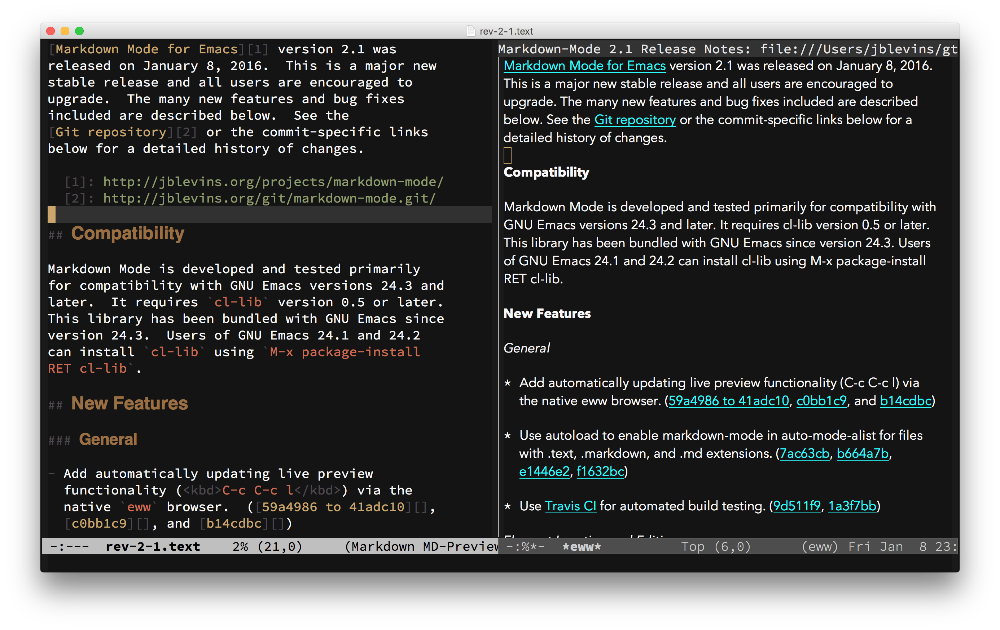

---
# Mode of Information Report: Lightweight Markup and Markdown
# 
# This paper was originally written for a class titled "Visual Information
# Science", taught by Dr. Ma at the University of Rhode Island. The "mode of
# information" refers to Poster's book from 1990 of the same title.
# 
# This work is licensed under the Creative Commons Attribution 4.0
# International License. To view a copy of this license, visit
# http://creativecommons.org/licenses/by/4.0/ or send a letter to Creative
# Commons, PO Box 1866, Mountain View, CA 94042, USA.
title: Markdown and the Mode of Information
author: Walter Lewis
...

Introduction
============

A markup language is a system for describing elements of electronic
documents to indicate structural, logical or semantic meaning
(Merriam-Webster, n.d.). In the past it was difficult to encode this
additional meaning in a way which distinguished it from the document's
contents, so non-printable characters were included with special
meanings. Instead, markup

> encode\[s\] this signaling information by overloading certain graphic
> characters with additional meanings. Therefore, markup languages allow
> for annotating a document in a syntactically distinguishable way from
> the text, while keeping the annotations printable. (IETF, 2016)

An example markup language is HTML, which is used primarily to structure
"hypertext" documents for use on the Internet, such as display in a Web
browser (IETF, 2003). In order to distinguish parts of the markup from
the content of the document, HTML uses XML-style tags, resulting in a
"tree" of nested markup elements. Although it may be read and written by
humans as regular text, its verbosity makes it more suitable to
processing by computers. A Web browser is an example of a computer
program which reads HTML and presents it in a human-readable form.

In contrast, so-called "lightweight" markup languages are designed to be
readable by humans as-is, with no computer needed to present the
document in a separate format. In contrast to XML's tags, which modulate
between text as content and text as markup, lightweight markup languages
use a small set of characters to informally indicate markup, treating
everything else as the document's content. For example, the lightweight
markup language Markdown uses punctuation characters to indicate markup.
Figure 1 shows a visual comparison (Wikipedia, n.d.).

A document written in Markdown in many ways resembles a printed
document: structure is implied through the use of graphical elements,
such as a row of dashes to indicate a preceding section heading,
asterisks to indicate bullet points, whitespace to indicate paragraph
breaks, etc. The "heavyweight" markup languages, by contrast, require
that structure be stated explicitly, using a large vocabulary of terms
which are difficult to memorize and type out. While lightweight markup
may lead to ambiguities and lack of standardization, it benefits from
being readable and producible by humans (including those with no
technical expertise) and a wide range of computer programs alike. The
result is that Markdown can be both "broadly compatible with humans" and
"push the boundaries of mutual intelligibility between software systems"
(IETF, 2016). These facts make lightweight markup an interesting subject
of study as a mode of information (Poster, 1990), with sociological
implications, as I hope to show. My focus is on Markdown in particular,
the most widely used example.

History of Markdown
===================

John Gruber developed Markdown in 2004, citing email as its primary
influence (Gruber, n.d.). Formatting conventions which arose informally
within communities communicating by email were used as the basis of the
syntax, and then a program was developed to convert this syntax to HTML.
Therefore, Markdown is both a language standard and a computer program
for structuring text in a way which mirrors email exchange. For example,
it is conventional in email threads to indicate quoted text from
previous messages by prefixing a `>` character to each line. In
Markdown, this same convention is used to indicate block quotes, which
are then converted to appropriate HTML tags. By writing the Markdown
*program*, Gruber effectively standardized these linguistic conventions
for use by writers in a whole range of fields, including software
documentation, mathematics, screenwriting, and academic publishing
(Shieber, 2014; Fountain, 2014; Mathdown, 2020). What began in the
example above as a convenient way to quote the body of an email is now
being used, for example, to quote sections of text referenced in
scholarly articles.

As a language standard, Markdown is much more informal than markup
languages like HTML. Unlike HTML, the Markdown specification "explicitly
rejects the notion of validity: there is no such thing as 'invalid'
Markdown" (IETF, 2016). Instead, the Markdown language evolved over time
in relation to the Markdown program:

> \[T\]he primary arbiter of the syntax's success is *running code*. The
> tool that converts the Markdown to a presentable format, and not a
> series of formal pronouncements by a standards body, is the basis for
> whether syntactic elements matter. (IETF, 2016)

Since the original Markdown program by Gruber in 2004, other software
has influenced its development and use in important ways. One such
program is Pandoc, which extends the ability to publish markdown to
formats besides HTML. In fact, Pandoc can convert to and from a wide
range of document types, using Markdown as a kind of *lingua franca* or
"least common denominator" through which they are all factored: a set of
"readers" for converting different formats *to* Markdown are paired with
another set of "writers" for producing documents of various formats
*from* Markdown (Pandoc, n.d.). The combination of Pandoc (the program)
and Markdown (the language) can now be used as a universal document
format. On the one hand, this allows a Markdown author to, for example,
convert their content to a Microsoft Word .docx file; on the other hand,
it allows the owner of a .docx file to convert this file to a whole
range of other formats by using Pandoc, with Markdown used by the
computer as an intermediary. Pandoc has been used, among other things,
to self-publish e-books and academic articles from plain text, to
produce slide shows for presentations, and for information storage and
retrieval in libraries (McDaniel, 2012; Ovadia, 2014).

The examples above highlight the flexibility and interoperability which
are features of Markdown and other lightweight markup languages. They
also demonstrate a blurring of the lines between language and tool,
natural language and programming language, human and machine.

Markdown in Use
===============

Although it is widely applicable, there are a few areas where Markdown
is most commonly used. One of the earliest and most widespread uses for
Markdown is in software documentation. For example, GitHub, the largest
platform for open-source software repositories, has its own flavor of
Markdown, most often used for the "readme" files which accompany
software packages (GitHub, 2019). These documentation files can then be
rendered in a Web browser for developers and users of the software
visiting the repository.

At a time when the majority of documents are composed with word
processors like Microsoft Word, some also stress the benefits of plain
text editors (McDaniel, 2012). Compared to word processors, these
programs are often free to use and relatively lightweight, in terms of
resource load and user interface complexity, making them accessible to a
much wider audience. The ability to produce documents in a free text
editor of similar quality to those produced in Word is a compelling
use-case for Markdown, Pandoc and the range of other lightweight markup
languages and software. Some text editors even have support for editing
Markup, with specially-designed user interfaces, such as in Figure 2
(Blevin, 2017).

Markdown and other lightweight markup languages can also be used purely
for their organizational utility. The same features which make Markdown
useful as a tool for quickly producing HTML (and other documents via
Pandoc), such as hierarchical structure, lists and tables, also make it
useful for organizing things like notes, to-do lists and journal entries
(Taggart, 2016).

Finally, Markdown and other lightweight markup languages have wide use
for information storage and retrieval. The rapid creation of accessible
and user-friendly documentation in a wide range of formats has made
Markdown useful in libraries (Ovadia, 2014). Presumably, as well, the
ability to transform documents between formats and to store them in a
human-readable and open format has implications for archiving as well.
However, I was not able to find examples of archival use of Markdown or
Pandoc.

Conclusion
==========

The wide array of use-cases which Markdown and other lightweight markup
languages facilitate, coupled with their immediacy and ease of
understanding, have changed the way many people interact with documents.
Whether users are producing published documents from Markdown,
converting between document formats with Pandoc, or using lightweight
markup as a tool for organizing and manipulating information as text,
what is gained is the ability to communicate structured language in
direct style. Even someone who has never seen Markdown before will
likely understand the meaning of its markup, perhaps unaware that it
represents a small language in its own right. The elements of this
language were not decided by a committee of experts but arose naturally
out of textual communication media like email. This is in contrast to a
"true" markup language like HTML, which requires many years of training
to read and write, and the development of which is decided by
organizations like W3C. Eschewing standardization and formality for
directness and readability, lightweight markup obscures the line between
human- and machine-readable language. The result is a mode of
information which unifies human and computer activity in interesting
ways, and continues to evolve within the communities which reproduce it.

Works Cited
===========

Blevin, J. (2017). *Markdown Mode*.
https://github.com/jrblevin/markdown-mode

GitHub. (2019). *GitHub Flavored Markdown Spec*.
https://github.github.com/gfm/

Gruber, J. (n.d.). *Markdown*.
https://daringfireball.net/projects/markdown

Internet Engineering Task Force (IETF). (2016, March). *The
text/markdown Media Type*. https://tools.ietf.org/html/rfc1866

IETF. (2000, June). *The 'text/html' Media Type*.
\[\[https://tools.ietf.org/html/rfc2854\]\]

IETF. (2016, March). *Guidance on Markdown: Design Philosophies,
Stability Strategies, and Select Registrations*.
https://tools.ietf.org/html/rfc7764

Fountain. (2014, March). *The Syntax: How to format a screenplay using
Fountain*. https://fountain.io/syntax

Mathdown. (2020, March). *Math in Markdown*.
https://github.com/cben/mathdown/wiki/math-in-markdown

McDaniel, C. (2012, September). *Why (and How) I Wrote My Academic Book
in Plain Text*. http://wcaleb.org/blog/my-academic-book-in-plain-text

Merriam-Webster. (n.d.). *Markup language*. In Merriam-Webster.com
dictionary. https://www.merriam-webster.com/dictionary/markup%20language

Ovadia, S. (2014). *Markdown for Librarians and Academics*. Behavioral &
Social Sciences Librarian, 33(2), 120-124. 10.1080/01639269.2014.904696

Pandoc. (n.d.) *About Pandoc*. https://pandoc.org/

Poster, M. (1990). *The Mode of Information: Poststructuralism and
Social Context*. University of Chicago Press.

Shieber, S. (2014, August). *Switching to Markdown for scholarly article
production*.
https://blogs.harvard.edu/pamphlet/2014/08/29/switching-to-markdown-for-scholarly-article-production/

Taggard, M. (2016, December). *Take Notes with Markdown*.
https://theforeverstudent.com/take-notes-with-markdown-2487fd838326

Wikipedia. (n.d.) *Markdown*. https://en.wikipedia.org/wiki/Markdown
